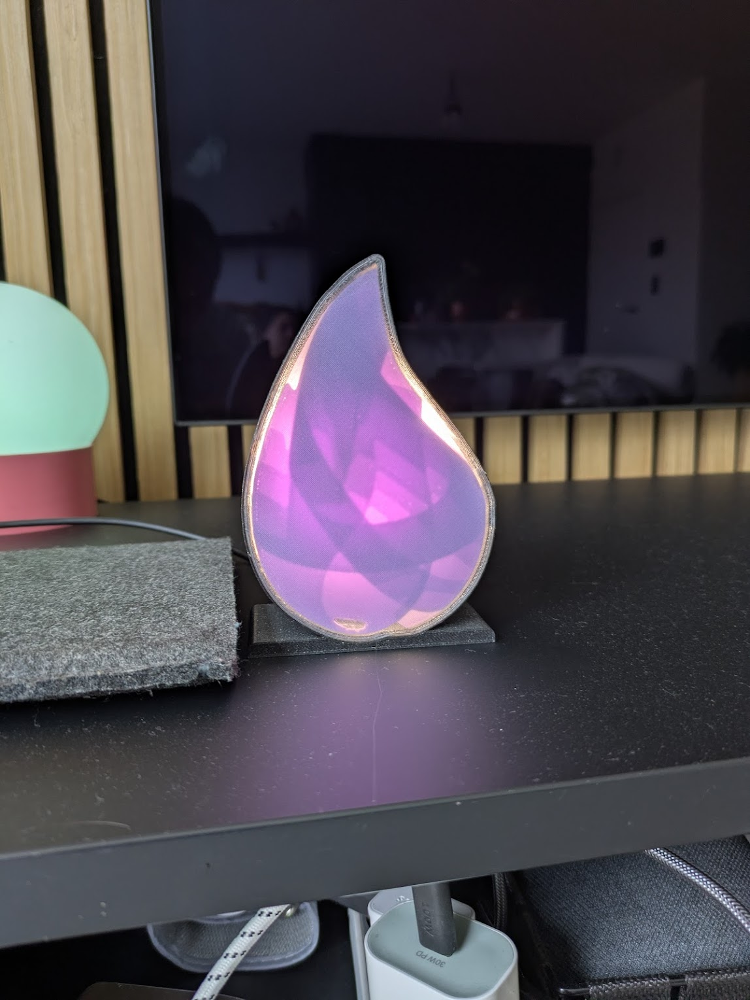
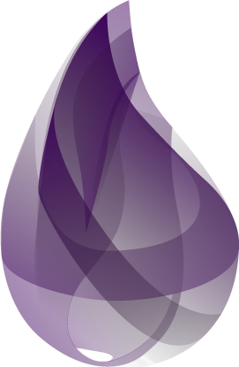
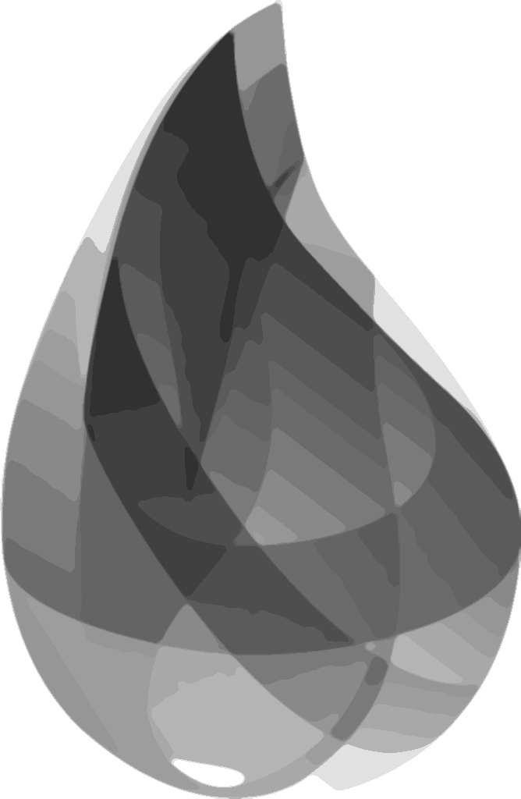
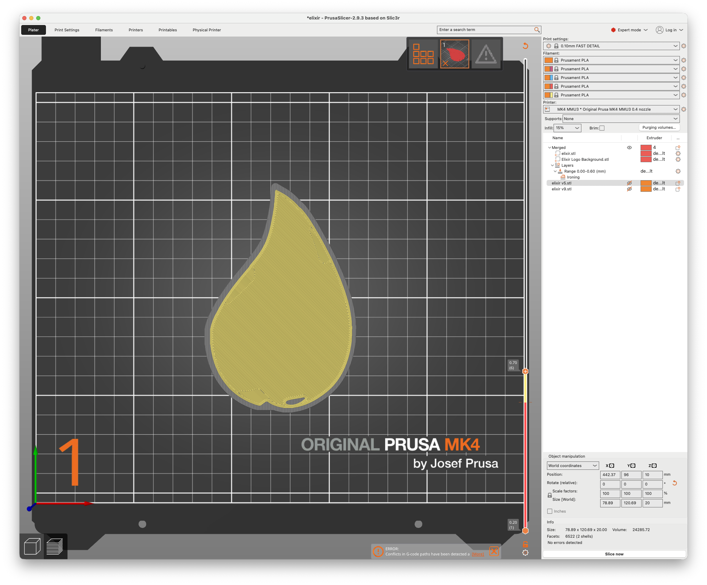
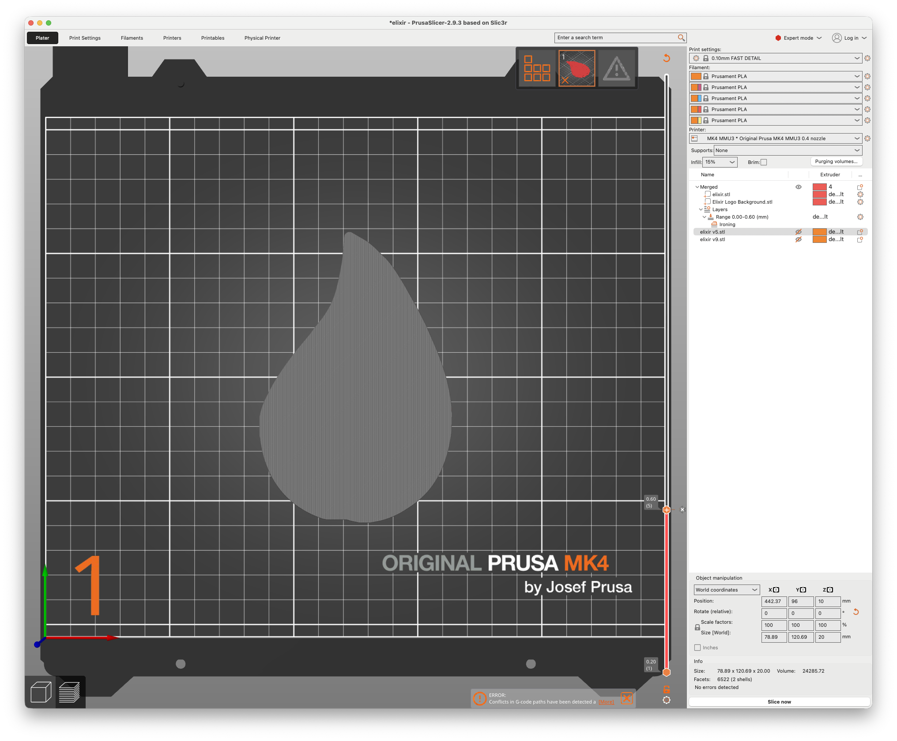
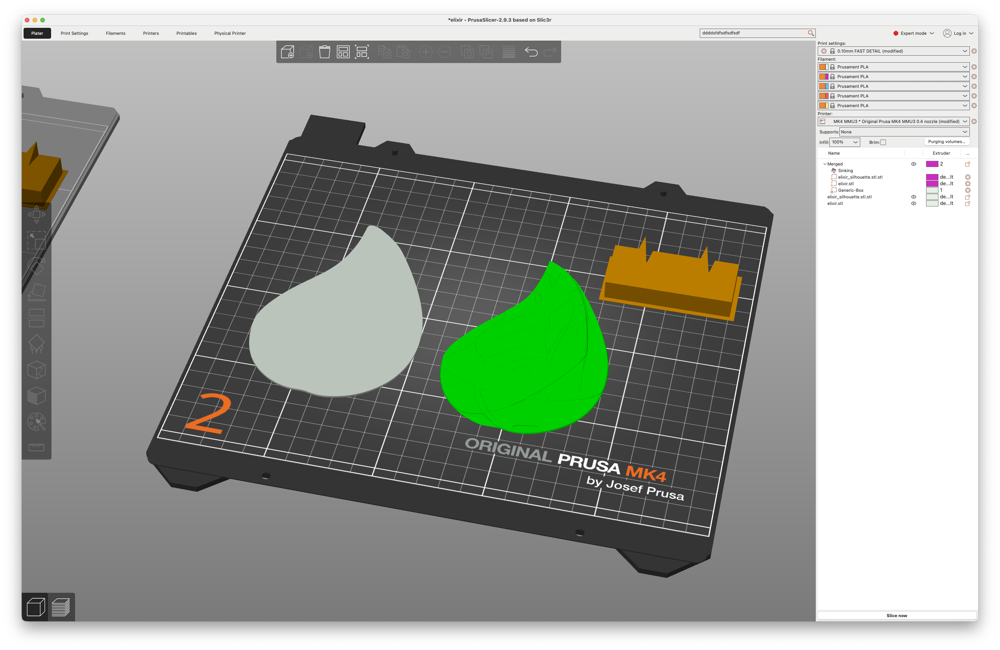
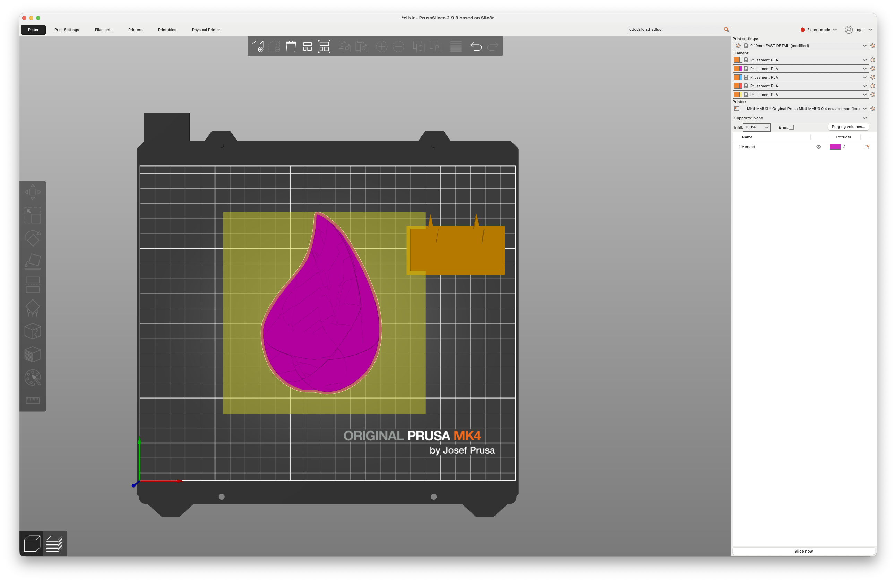

# Elixir Logo Light

This repo contains all the things you need to make your own Elixir light.

To make it from scratch, you need 2 things:

 - 3D print the housing based on the STL files attached in the `3d/` folder.
 - An ESP32 with some LEDs to make it work.
## Printing

All the models for printing are available under `3d`. You will find the STL
files for printing, a 3mf file for opening it in the slicer, and an f3d file for
opening up the enclosure model in Fusion 360.

If you just want to print your own light, you should have enough with the .stl
files.

If you don't want to regenerate the files and just want to print it, you can
find all STL files under the `3d/elixir` folder. Notice that the Elixir logo is
mirrored. This is on purpose. The purple lines are inside the enclosure because
they're not that nice to look at.

The Erlang logo can be found under `3d/erlang`.

## Generating the STL file

The STL file generated from the logo is a bit finnicky. I have tried several
parameters, but the generated STL file is not good, really. But it works for
printing.

I have split up the STL into a silhouette to place into the housing, and the
purple layers to create the actual logo.

The python project in `logo` takes in a logo and generates the STL. The main
steps are:

### Preprocessing

 - Remove the alpha channel and replace it with white. You need to have a color
   everywhere, otherwise your STL output will not be connected and consist of
   several pieces (`remove_alpha`)
 - Convert the image to grayscale (we're only printing transparent and 1 color).
 - Quantize the image to have maximum 14 different shades of gray. These shades
   will correspond to the amount of layers of color we will have in the print.
 - Use a median filter to remove sharp edges in the logo. This can be tuned for
   logos that do not have clear edges (like the Elixir logo). For the Rust logo
   this was not required, for example.

| Original                                                     | No Alpha                                                       | Grayscale                                                       | Quantized                                                       | Median Filter                                                       |
| ------------------------------------------------------------ | -------------------------------------------------------------- | --------------------------------------------------------------- | --------------------------------------------------------------- | ------------------------------------------------------------------- |
|  |  |  |  |  |
### Generate a heightmap

The heightmap will map the darkness of the color into a 3d array of heights. The
darker the color, the higher the height will be.

All the pixels surrounding the logo will be white, and will not be printed.
Otherwise your 3d print would be a square. Because of this, spots in the logo
that are completely white will not be printed. To avoid this, we fill in these
holes with a hard-coded height of 1 (`fill_holes`). An example of this is the
bottom of the Elixir logo has a white spot. This would have been a hole
otherwise.

| First Color Layer                                    | Transparent Layer                                          |
| ---------------------------------------------------- | ---------------------------------------------------------- |
|  |  |

## Printing The Logo

The logo is generated with a layer height of 0.1 in mind. This is to make sure
that the layers arent too thick and the most dark colors still let some light
through. You can experiment with this by tuning the `layer_height` parameter in
the python code.

Import the Elixir.stl file into your slicer and select the layer at which to change colors.

For the Elixir logo I used:

 - https://polymaker.com/product/polyterra-pla/ Lavender
 - https://www.prusa3d.com/product/prusament-petg-clear-1kg/

Since these are two different filaments (PLA and PETG), I do not recommend
mixing these two within a single layer. Or maybe you do, what do I know.

I have added the 3mf file I used to print it. Make sure to set the layer height
to the layer height used in the STL generation!

## Postprocessing

The STL generated is not that good, and contains an insane amount of triangles.
This means that importing it into Fusion and turning it into a body is nearly
impossible. For this reason, a bit of postprocessing is required.

Running the python code will generate `output/elixir.stl` and
`output/elixir_silhouette.stl`. In Fusion, you can then generate a simple model
to represent the shape of the logo as follows.

 - Import the STL file `outputs/elixir.stl`.
 - In the `Mesh` tab, `Create mesh section sketch` at height 0.5mm or so.
 - In the generated sketch edit mode, fit a curve around the section sketch with
   a fitting of +- 1mm.
 - Next, create an offset curve on the generated fitted curve of +- 2mm.
 - You now have a sketch that can be used to extrude a plain silhouette that
   will hold the logo.
 - In PrusaSlicer, you can merge the purple STL file with the silhouette STL
   file and then stack them on top of eachother.

| First Color Layer                                    | Transparent Layer                                          |
| ---------------------------------------------------- | ---------------------------------------------------------- |
|  |  |

## Programming

I have put in an ESP32 and flashed it with the esphome firmware you can find
under `esphome`. Note that this Esp Home file assumes that red, green, blue, and
white LEDs are all connected to separate pins.

## The Electronics

The electronics are repurposed PCBs I had lying around. They're circular PCBs
with an ESP32 on top and a USBC connector at the bottom.
The model can be modified in Fusion to remove the placeholders if necessary.

## Contributing

If you have any suggestions, contributions or whatever, you know the drill. If
you have questions on how to make it, you can find me on libera under `m1dnight`
or the Elixir slack.

## Copyright

This logo is from the Elixir Team, and you can't just do whatever you want with
it. Don't get sued, read here: https://elixir-lang.org/trademarks.html